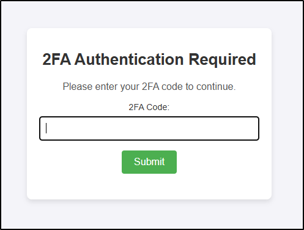

# BasicAuthTOTP Caddy Plugin

> [!Important]
> With version v0.4.0 (released in February 2025) of this plugin, the server-side session management and the logout functionality were dropped in favor of JWT-based (JSON Web Token-based) session management. The configuration options `logout_session_path` and `logout_redirect_url` must be removed from your Caddy configuration.
> With version v0.5.0 a **base64-encoded** `sign_key` of at least 32 bytes is now required to securely sign the tokens and ensure their integrity.

The **BasicAuthTOTP** plugin for [Caddy](https://caddyserver.com) enhances Caddy's basic authentication with Time-based One-Time Password (TOTP) two-factor authentication (2FA).
This module supplements `basic_auth` and does not replace it; therefore, `basic_auth` must be configured and active for this plugin to function correctly. It's adding an extra layer of security for web applications and services hosted with Caddy.

> [!TIP]
> For more extensive authentication, authorization, and accounting requirements, consider using [AuthCrunch / caddy-security](https://github.com/greenpau/caddy-security). AuthCrunch provides a comprehensive AAA solution, supporting Form-Based, Basic, Local, LDAP, OpenID Connect, OAuth 2.0 (e.g., GitHub, Google, Facebook), SAML Authentication, and 2FA/MFA (including app-based authenticators and Yubico). It also offers authorization with JWT/PASETO tokens, making it ideal for more complex or larger-scale environments.

**BasicAuthTOTP** is best suited for smaller, perhaps internal user groups who require added security for specific endpoints but do not need a full-featured authentication, and authorization solution. It requires users to authenticate with both a valid TOTP code and basic auth credentials, making it suitable for lightweight, targeted protection of sensitive resources.

## Features

This plugin introduces additional authentication steps within Caddy configurations:

- **TOTP Authentication**: Requires users to enter a valid TOTP code in addition to basic auth credentials.
- **JWT-based session management** with configurable inactivity-based expiration and IP-based session validation to prevent session hijacking.

Instead of server-side session management, this module uses JWTs stored in cookies to manage sessions. This approach simplifies session handling and no sessions are lost when Caddy is reloaded or restarted. However, this approach is less secure than server-side session management, as JWTs are not invalidated or blacklisted. To mitigate risks, the module uses IP binding to ensure that the JWT is only valid for the client IP address that created it. If the client IP changes, the user must re-authenticate.

### Authentication Flow

When accessing a protected route, users will first be prompted to enter their Basic Authentication credentials. After successfully completing Basic Authentication, they will see a 2FA prompt to enter their TOTP code, as shown below:

<p align="center">
  
</p>

> [!NOTE]
> **Content Security Policy (CSP)**: The 2FA form applies a dedicated CSP header with a unique nonce for inline styles and sets `form-action` to `'self'`, which overwrites any other CSP configuration that might otherwise restrict inline styles or form submissions. This ensures the form functions correctly and securely.

## Disclaimer

**Experimental Module**: This plugin is currently in an experimental phase and is primarily developed to meet specific, personal requirements. While contributions and suggestions are welcome, please be aware that this module may lack certain features or robustness expected in production environments.

> [!Important]
> Due to its experimental nature, this plugin is **not yet intended for use in production or mission-critical systems**. Use it at your own risk. The author assumes no responsibility for potential security risks, stability issues, or data loss that may arise from its use in such environments.

## Building

To build Caddy with this module, use xcaddy:

```bash
$ xcaddy build --with github.com/steffenbusch/caddy-basicauth-totp
```

## Caddyfile Config

By default, the `basic_auth_totp` directive is ordered after `basic_auth` in the Caddyfile. This enables seamless integration with Caddy's existing basic authentication system. Below is an example configuration, followed by detailed explanations of each configuration option.

```caddyfile
:8080 {
    handle /top-secret/* {
        basic_auth {
            user hashed_password
        }

        basic_auth_totp {
            session_inactivity_timeout 2h
            secrets_file_path /path/to/2fa-secrets.json
            cookie_name batotp_sess
            cookie_path /top-secret
            form_template /path/to/custom-2fa-form-template.html
            sign_key AWhvKpXr0CYdbW+Da+bBDTBX5nyqYCTKGNWpC0CeWhY=
        }

        respond "Welcome, you have passed basic and TOTP authentication!"
    }
}
```

### Configuration Options

- **`session_inactivity_timeout`**: Sets the maximum period of inactivity allowed before a session expires, requiring re-authentication. Default is `60m`.
  - *Usage Tip*: A shorter inactivity timeout improves security by prompting for re-authentication if users are inactive, while a longer timeout enhances convenience for active users.

- **`secrets_file_path`**: Specifies the path to a JSON file containing TOTP secrets for each user, required for validating TOTP codes.

  - Example JSON structure:

  ```json
    {
    "users": [
      {
        "username": "user1",
        "secret": "F2MV5KORBGRG5GTEUKHKF3YJYXJPC45PS7YHVV4GFIIWEYQE"
      },
      {
        "username": "user2",
        "secret": "BABC3SA2W523ZMLXH73IN46FBWJPEKLLPPL53AO44LWFIS5T"
      }
    ]
  }
  ```

  Each user should have a unique TOTP secret, formatted in **Base32** without padding (`=`). This key will later be used by a TOTP-compatible app (such as Google Authenticator or Authy) to generate time-based one-time passwords.

- **`cookie_name`**: Defines a custom name for the session cookie that stores the 2FA token. Default is `batotp_sess`.

- **`cookie_path`**: Sets the path scope of the session cookie, defining where it will be sent on the server. Default is `/`.
  - *Usage Tip*: Ensure this aligns with the URL path protected by `basic_auth`, as the cookie will only be sent to matching paths.

- **`form_template`**: Path to the HTML template file for the 2FA authentication page. If not specified, an embedded default template `default-2fa-form.html` will be used.

- **`sign_key`**: The base64-encoded secret key used to sign the JWTs. This key will be decoded to bytes for JWT signing.
  - *Usage Tip*: To create a secure base64-encoded sign key, you can use the command `openssl rand -base64 32`. This command generates a random 32-byte key and encodes it in base64 format.
  - *Placeholder Support*: You can also use a placeholder to reference a file containing the key, such as `{file./path/to/jwt-secret.txt}`. The file's content will be read and used as the signing key.

### Template Context

The available information in the template context includes:

- `Username`: The username of the user (HTML escaped).
- `Errormessage`: Any error message to be displayed.
- `Nonce`: A nonce used for inline styles.

### Session Management Explanation

The session is managed with an inactivity-based expiration. Once a user authenticates with a TOTP code, a session is created with an inactivity timeout (`session_inactivity_timeout`). Each valid request within this timeout period extends the session expiration by the specified inactivity duration, but only if less than 50% of the timeout remains. This reduces the frequency of session updates, optimizing performance by minimizing lock contention.

#### Generating a TOTP-compatible Secret

To create a secure, random key in the correct format, you can use the following command:

```bash
openssl rand 30 | base32 | tr --delete '='
```

**Explanation of the command:**

- **`openssl rand 30`**: Generates 30 random bytes.
- **`| base32`**: Converts the random bytes to Base32 format.
- **`| tr --delete '='`**: Removes any `=` padding characters, which are not needed in TOTP format.

This Base32 key can then be stored in `secrets_file_path` and will be used by the TOTP library to generate one-time passwords.

#### Setting Up the Secret in a 2FA App

If you want to set up the secret directly in a 2FA app, you can also generate a QR code that includes the Base32 secret. A useful tool for this is the [2FA QR Code Generator](https://stefansundin.github.io/2fa-qr/), where you can input the Base32 key to create a scannable QR code for the app.

## Security Considerations

- **TOTP Secret Management**: Ensure that the `secrets_file_path` is secure and not accessible via the web server. This file contains sensitive user secrets and should be protected from unauthorized access.
- **Inactivity Timeout**: Choose an appropriate `session_inactivity_timeout` that balances usability and security. Shorter timeouts enhance security but may inconvenience users by requiring frequent re-authentication.
- **Session Renewal Optimization**: To optimize performance, sessions are only extended when less than 50% of the inactivity timeout remains. This approach reduces the frequency of session updates and improves handling of concurrent access.
- **IP Binding**: Sessions are automatically bound to the client’s IP address, providing an additional layer of security against session hijacking. This setting cannot be disabled. By default, the session is tied to the client’s IP address, meaning that if a user’s IP address changes (e.g., due to network switching), they will be required to re-authenticate with a TOTP code. This feature enhances security by ensuring that each session is restricted to a specific client IP.
- **Cookie Security**: The session cookie is set with `HttpOnly`, `Secure`, and `SameSite=Lax` attributes. These settings help prevent attacks, but `SameSite` is not currently configurable.
- **Brute-Force Attack Prevention and Logging**: To help prevent brute-force attempts on TOTP codes, the plugin logs each invalid TOTP attempt with the username and client IP, such as:

    `2024/11/01 08:08:36.099 WARN    http.handlers.basicauthtotp      Invalid TOTP attempt    {"username": "user1", "client_ip": "4.8.15.16"}`

    This log entry provides crucial information for security monitoring and can be used with `fail2ban` or similar tools to block repeated failed attempts.
- **TOTP Validation Settings**: The plugin uses TOTP validation settings compatible with Google Authenticator, including:
  - 6-digit codes,
  - A 30-second code validity period,
  - A skew allowance of one period (±30 seconds) for clock drift,
  - SHA-1 as the HMAC algorithm.

  These settings are applied by default in the `Validate` function to maintain compatibility with most authenticator apps while ensuring secure TOTP verification.

## License

This project is licensed under the Apache License, Version 2.0. See the [LICENSE](LICENSE) file for details.

## Acknowledgements

- [Caddy](https://caddyserver.com) for providing a powerful and extensible web server.
- [pquerna/otp](https://github.com/pquerna/otp) for TOTP functionality, used under the Apache License 2.0.
